# NATIVE LANGUAGE IDENTIFICATION USING TENSORFLOW

In this project we will build a text classification model using pre-trained BERT vectors to address the task of native language identification using deep learning techniques.

# PROJECT SET-UP
First we cloned the [BERT repository](https://github.com/google-research/bert). In our case we downloaded and used the BERT-BASE Uncased model with 12 layers (L=12), 768 as hidden size (H=768) and 12 self-attention heads as its parameters throughout the project.

## PROJECT STRUCTURE
The project folders and code is structured on the following way:

* _**bert**_: This folder contains the cloned BERT repository and additional files. Within this folder we have other main folders.
* _**handouts**_: This folder contains all the provided handout materials. We add the *initial_data_cleaning.sh* script to re-format the textfiles in this folder as well as the hw4.py.

# STEPS FOR REPRODUCING RESULTS

## 1 - LIBRARIES INSTALLATION

Once we have cloned locally the BERT repository, we need to install all the requirements for being able to use the BERT Models. For doing so just install all the required libraries by executing:

- *pip install -r requirements*

**IMPORTANT NOTE**

We run into problems because of the tensor-flow version that was installed. Downgrade the tensorflow version from v2.0 to v1.15 before running the *run_bert_fv.sh* script.

## 2 - DATA PREPARATION

Afterwards, we need to re-format the datafiles so that they can be passed as input files to the BERT Model. In order to re-format the datafiles for being able to pass them as input text to the BERT Model, we created a bash script saved in *handout/initial_data_ceaning.sh*, which re-formats each input file so that they have each text in a single line with no additional information. For running this script you should:

1. Check that the *initial_data_cleaning.sh* bash script has execution permissions with ls -l.
2. If it does not have it, enable execution of the bash script with *chmod +x initial_data_cleaning.sh*.
3. Execute the *initial_data_cleaning.sh* bash script. Note that the output of this script is saved under the directory *bert/bert_input_data*.

## 3 - GENERATE FEATURE VECTORS WITH BERT

Once we have prepared the input data, now we can generate the feature vectors by running the BERT *extract_features.py* python script. Note that we made some changes to this script in order to reference correctly the data directories. Check the *handout/run_bert_fv.sh* so that it has the following directories definitions:

- *__BERT_BASE_DIR__ = $HOME/cs585/homework/hw4/bert*
- *__BERT_DATA_DIR__ = $BERT_BASE_DIR/models/uncased_L-12_H-768_A-12*
- *__INPUT_DIR__ = $BERT_BASE_DIR/bert_input_data*
- *__OUTPUT_DIR__ = $BERT_BASE_DIR/bert_output_data*

Then we are ready to run the script. Again check the execution permissions of the bash script *handout/run_bert_fv.sh*. Run the scripts and the outputs will be saved in *bert/bert_output_data*

## 4 - RUN THE HOMEWORK 4 PYTHON SCRIPT.
The Homework 4 python script will run all the necessary code for the homework requirements. It is saved in the folder handout. First of all you need to check if you have folders *__data__* and *__images__* inside handout folder. If not, create them, they will be necessary for the hw4.py to work correctly. 
Note that we have used a Logistic Regression model for the text classification homework.
The hw4 python script execute various step that we define here:

0. Set-up directories.
1. Read dataframes of all datasets (train, test and eval).
2. Load bert features representations for all datasets.
3. Set the most efficient hperparameters for the Logistic Regression model. For doing so we tested against all 3 datasets different configurations with different c values and check the accuracy for each configuration.
4. Create model with best hyperparameters.
5. Output results for each dataset and analyse per native language results.

For running the python script, you should go to the hanndout directory and execute:

__`python hw4.py`__

The script will generate all the images and save them to the images directory.

We saved the output of running the python script to a file called output_summary.txt. Nevertheless, we provide here what the output looks like:


```bash
Data Directory provided in the handout is: data
Data Directory where feature vectors generated by bert extract_features.py are saved is:         ../bert/bert_output_data
Image Directory is: images
```

We can take a look at the accuracies for the different c values and the different datasets.

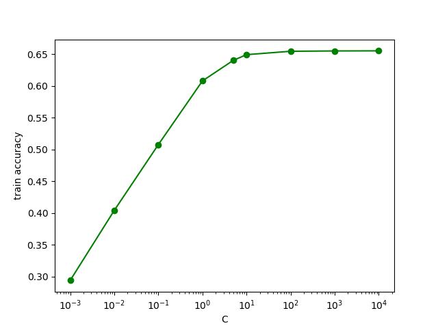

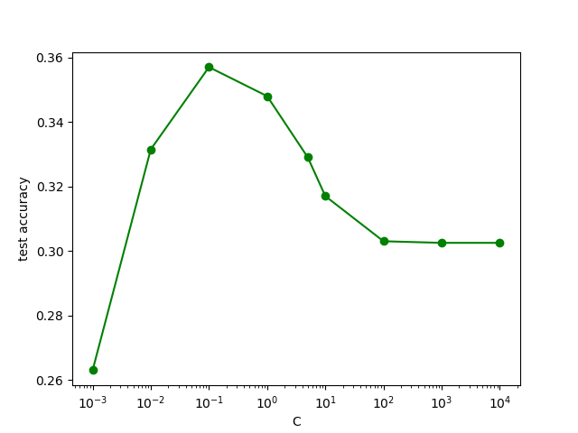

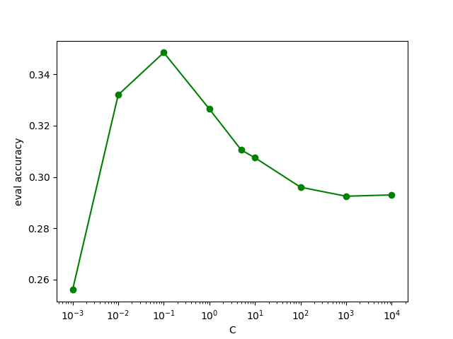

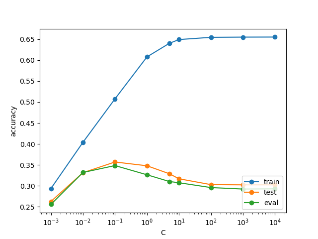

We can see that accuracy increases as c increases, nevertheless after c=0.1, accuracy for test and eval datasets decreases. This shows us that the model is suffering overfitting of the test dataset, so we choose c=0.1 as our hyperparameter for the model.

```bash
Best c value was 0.1 with accuracies:
        train acc=50.75%     test acc=35.70%     eval acc=34.85%


===============================================TRAIN================================================
Results for dataset TRAIN
Accuracy for train dataset: accuracy=50.75% 

Per Class metrics for dataset TRAIN.

LANGUAGE           PRECISION(%)       RECALL(%)  TOP MISS CLASS. LANGUAGE
ARABIC                   54.70%          55.33%                  Spanish
CANTONESE                44.62%          42.83%                 Mandarin
JAPANESE                 51.04%          57.17%                   Korean
KOREAN                   55.78%          50.67%                 Mandarin
MANDARIN                 41.08%          43.00%                Cantonese
POLISH                   52.30%          53.17%                  Russian
RUSSIAN                  52.79%          53.67%                   Polish
SPANISH                  52.71%          48.67%                   Polish
THAI                     58.24%          59.50%                 Mandarin
VIETNAMESE               44.62%          43.50%                Cantonese
MICRO AVG                50.75%          50.75%                        -
MACRO AVG                50.79%          50.75%                        -
WEIGHTED AVG             50.79%          50.75%                        -
```

We can see in these bar plots both the precision and recall metrics for each native language.

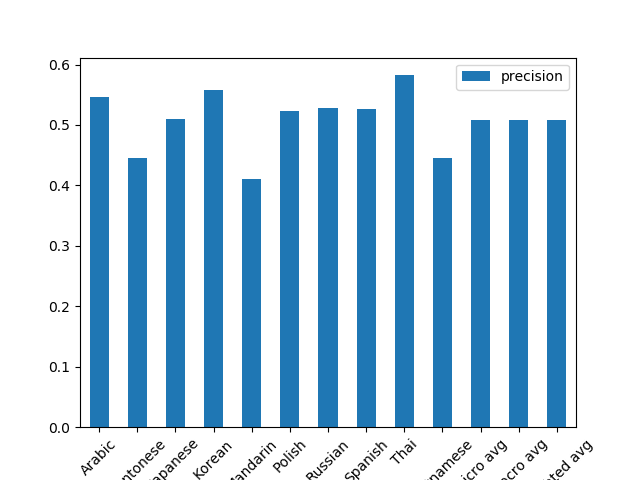

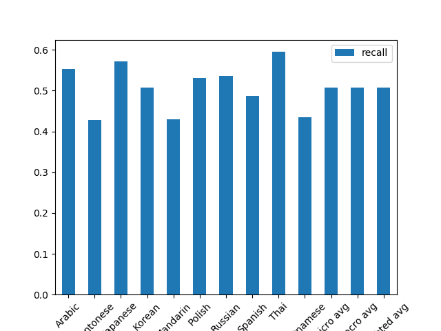

Next we provide the confusion matrix for the predictions of the model so we can analyze the missclassifications per native language.

Confusion matrix, without normalization
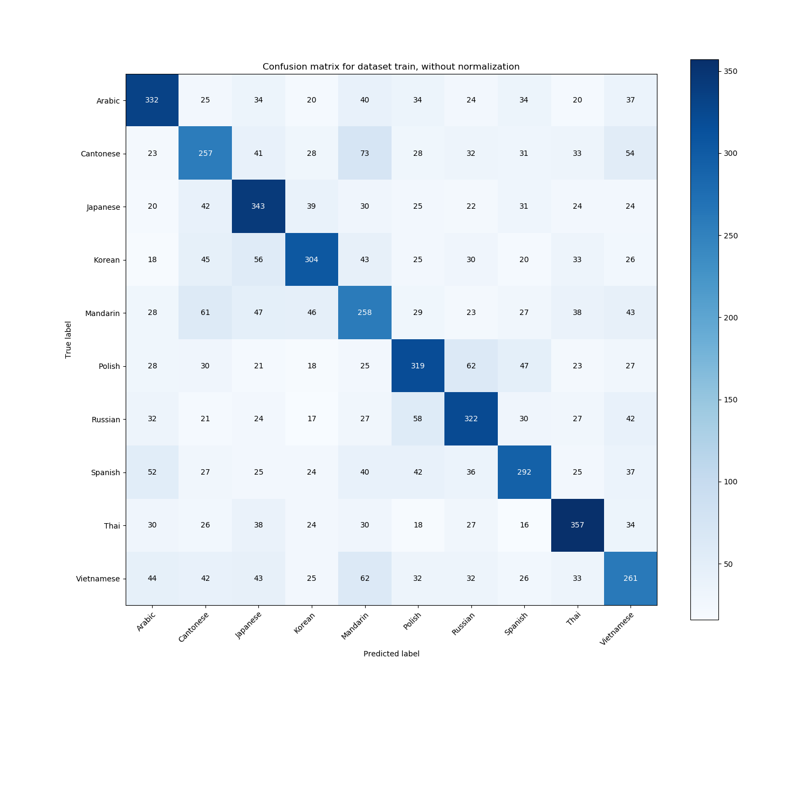

Normalized confusion matrix


In addition to the summary provided in the output of the python script, we can easily perform a cross class missclassifications just having a look at the normalized confusion matrix. Taking into account that we computed a normalized confusing matrix by columns, if we take a look at each column, we will see the percentage of missclassifications for each native language for all the other languages. Moreover, we have the maximum missclassifications per native language printed in a pretty table alnog with other metrics. For example, if you take a look at the train dataset normalized confusion matrix, you will see that for the native language Arabic, 55% of the Arabic texts were correctly classified, while 9% of them were missclassified as Spanish and 7% as Vietnamese. For the native language Korean for example, 56% of the korean texts  were correctly classified while 8% of them were missclassified as Mandarin and 7% of them were classified as Japanese.

As we see a complete analysis can be easily done just taking a look at the normalized confusion matrix. We store images for all the datasets in the image directory.

We provide the same information and images for the test dataset and the eval dataset.

```bash
================================================TEST================================================
Results for dataset TEST
Accuracy for test dataset: accuracy=35.70% 

Per Class metrics for dataset TEST.

LANGUAGE           PRECISION(%)       RECALL(%)  TOP MISS CLASS. LANGUAGE
ARABIC                   38.22%          36.50%                   Polish
CANTONESE                26.51%          28.50%                 Mandarin
JAPANESE                 35.65%          38.50%                   Korean
KOREAN                   37.57%          34.00%                 Mandarin
MANDARIN                 30.77%          32.00%                Cantonese
POLISH                   38.10%          36.00%                  Russian
RUSSIAN                  39.39%          39.00%                   Polish
SPANISH                  38.66%          37.50%                   Arabic
THAI                     46.00%          46.00%                Cantonese
VIETNAMESE               27.88%          29.00%                Cantonese
MICRO AVG                35.70%          35.70%                        -
MACRO AVG                35.88%          35.70%                        -
WEIGHTED AVG             35.88%          35.70%                        -
```

We can see in these bar plots both the precision and recall metrics for each native language.

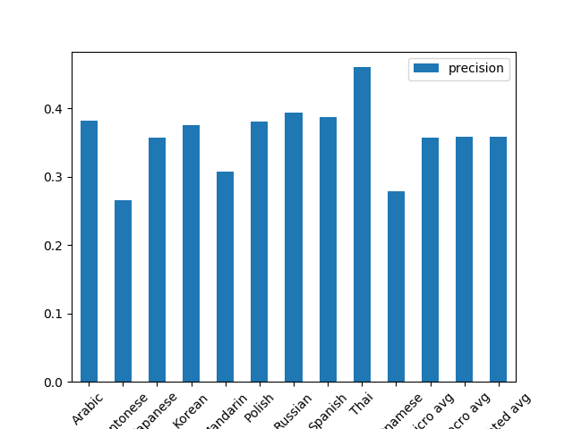

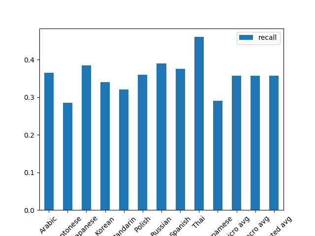

Next we provide the confusion matrix for the predictions of the model so we can analyze the missclassifications per native language.

Confusion matrix, without normalization
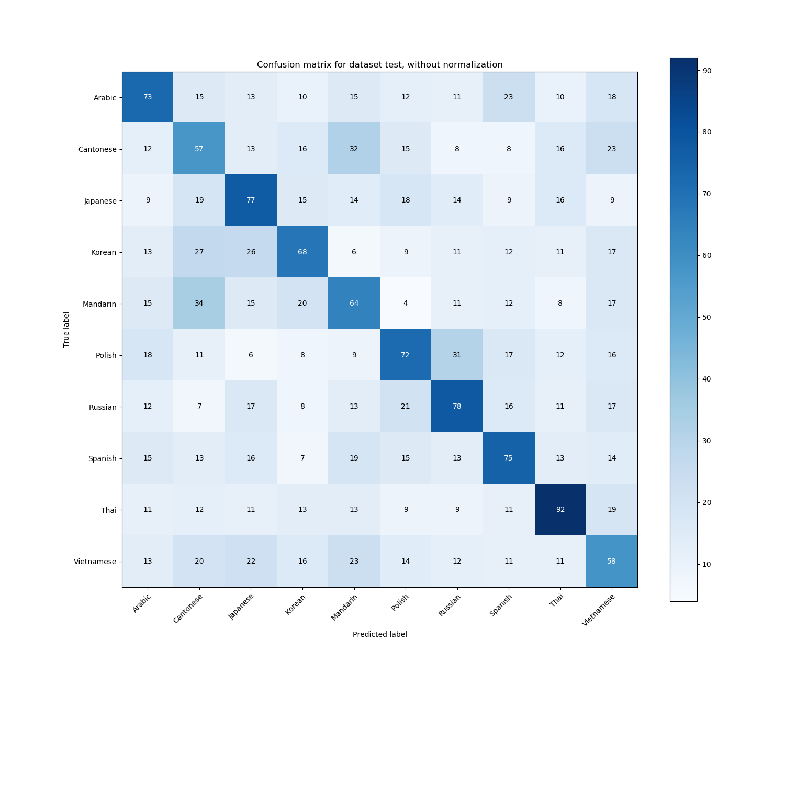

Normalized confusion matrix
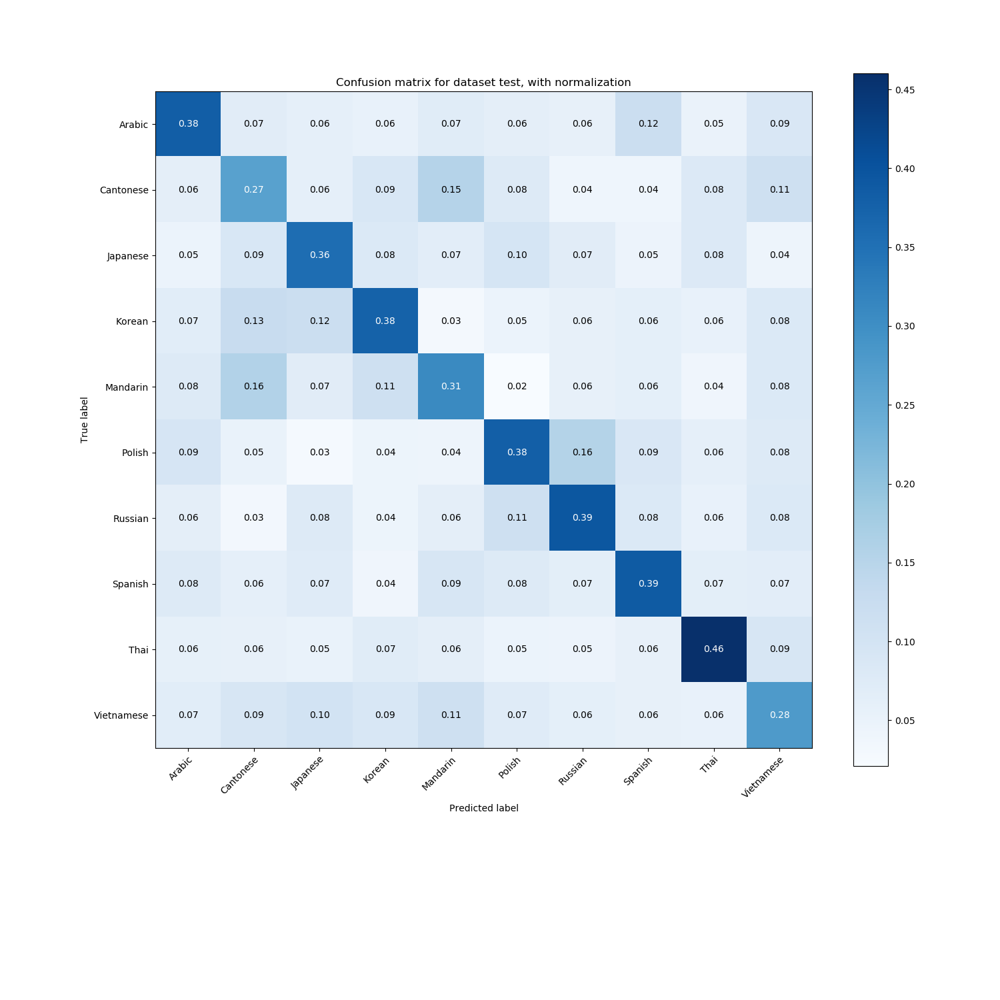

```bash
================================================EVAL================================================

Results for dataset EVAL
Accuracy for eval dataset: accuracy=34.85% 

Per Class metrics for dataset EVAL.

LANGUAGE           PRECISION(%)       RECALL(%)  TOP MISS CLASS. LANGUAGE
ARABIC                   37.25%          38.00%               Vietnamese
CANTONESE                28.11%          30.50%                 Mandarin
JAPANESE                 36.17%          42.50%               Vietnamese
KOREAN                   36.07%          33.00%                 Japanese
MANDARIN                 26.74%          25.00%                Cantonese
POLISH                   40.96%          38.50%                  Russian
RUSSIAN                  37.43%          35.00%                   Polish
SPANISH                  34.39%          32.50%                   Polish
THAI                     44.70%          48.50%                   Korean
VIETNAMESE               25.91%          25.00%                 Mandarin
MICRO AVG                34.85%          34.85%                        -
MACRO AVG                34.77%          34.85%                        -
WEIGHTED AVG             34.77%          34.85%                        -
```
We can see in these bar plots both the precision and recall metrics for each native language.

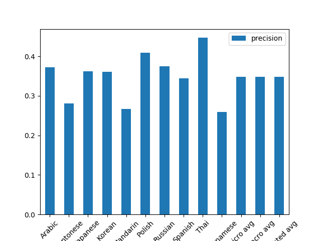

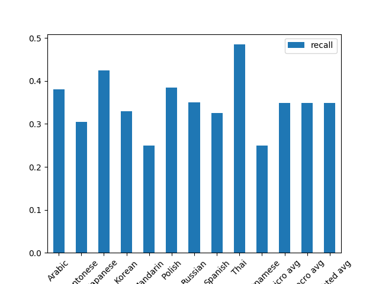

Next we provide the confusion matrix for the predictions of the model so we can analyze the missclassifications per native language.

Confusion matrix, without normalization
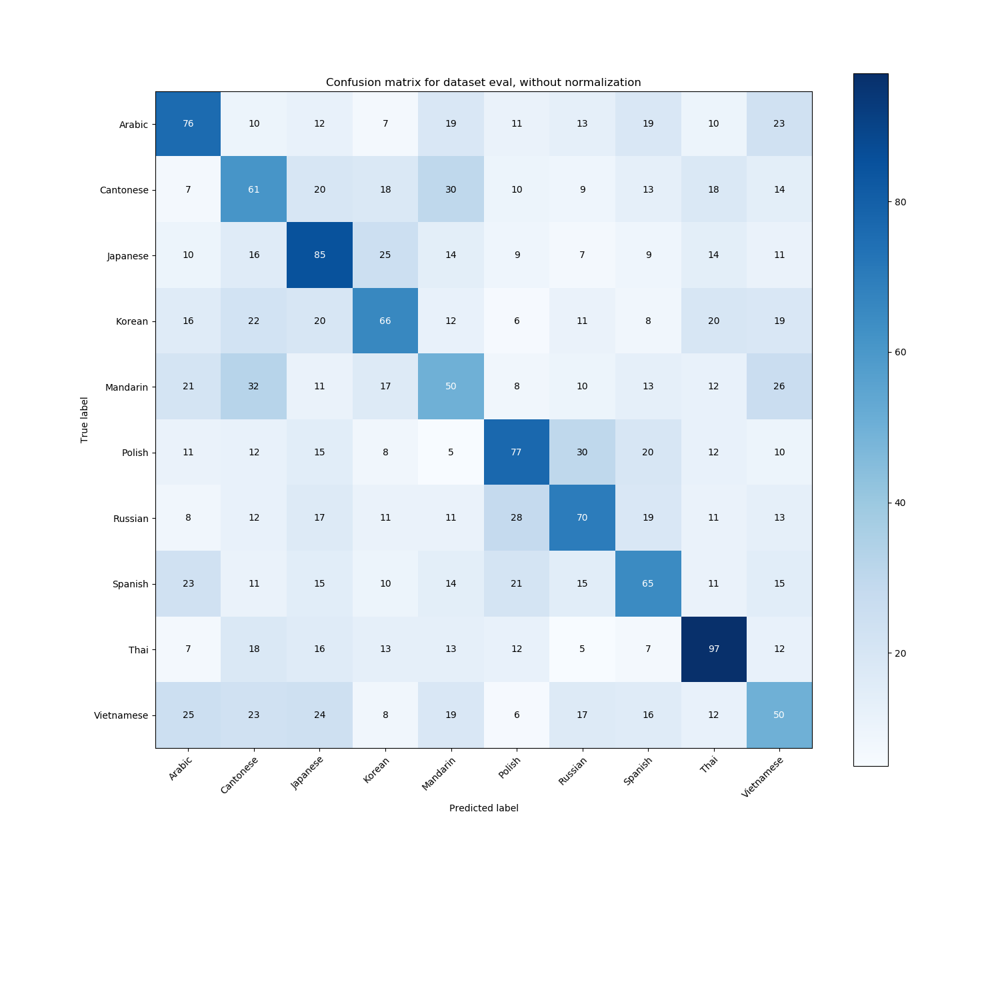

Normalized confusion matrix
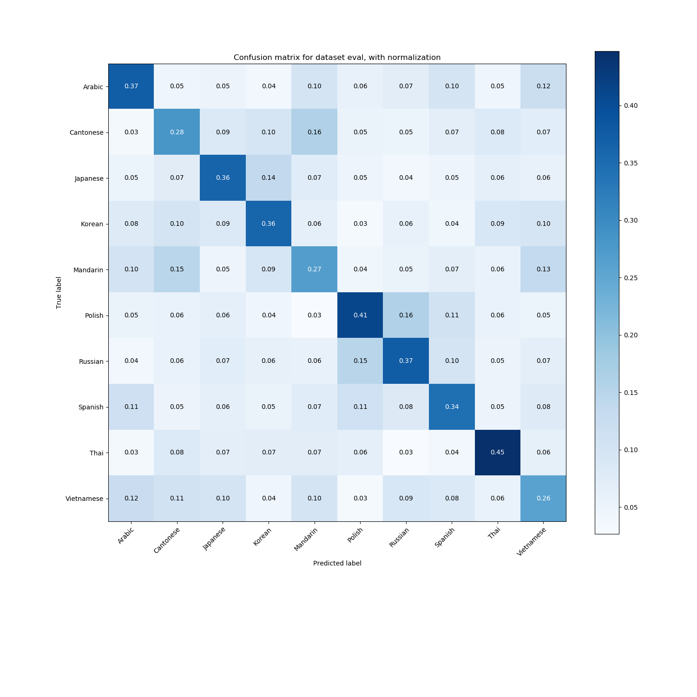